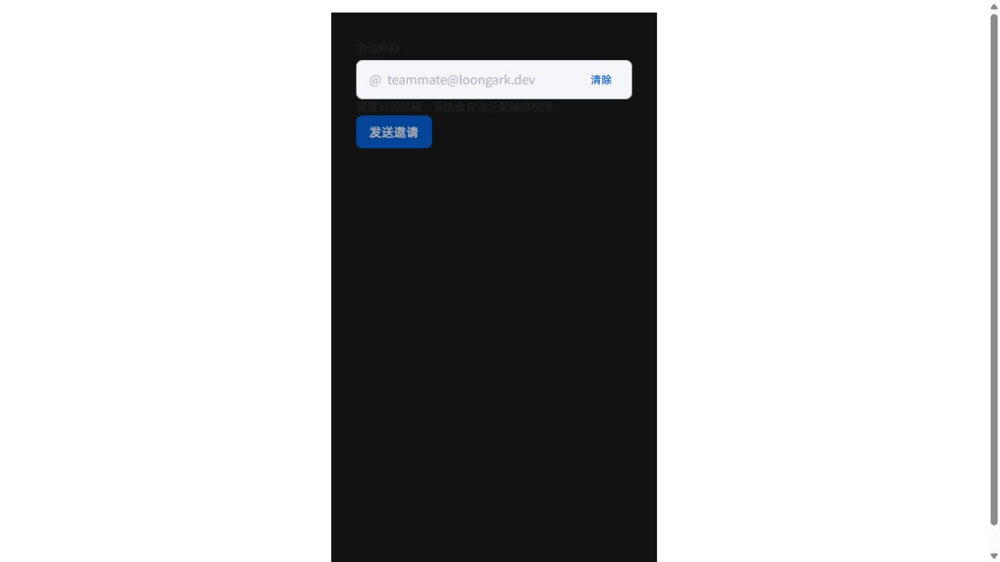
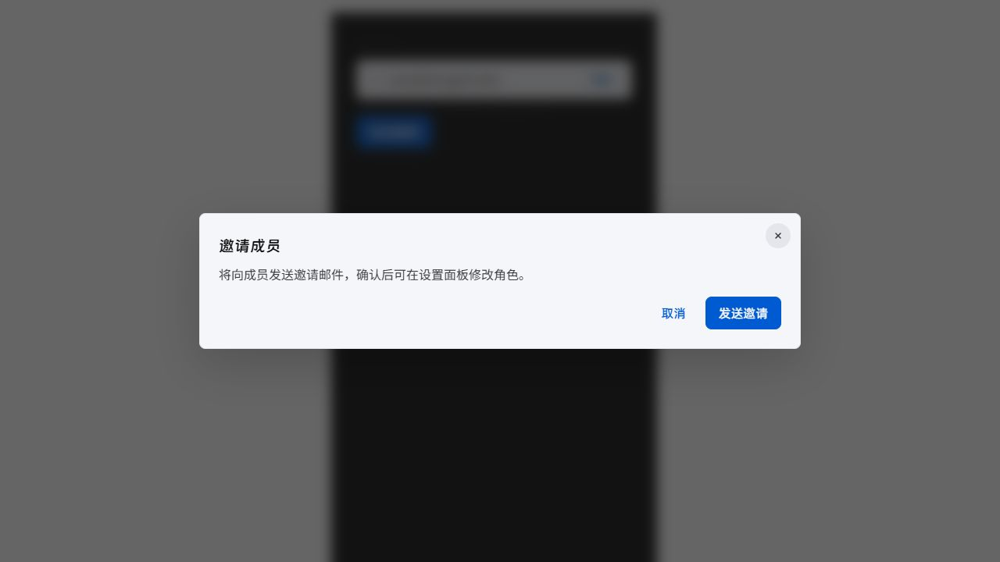
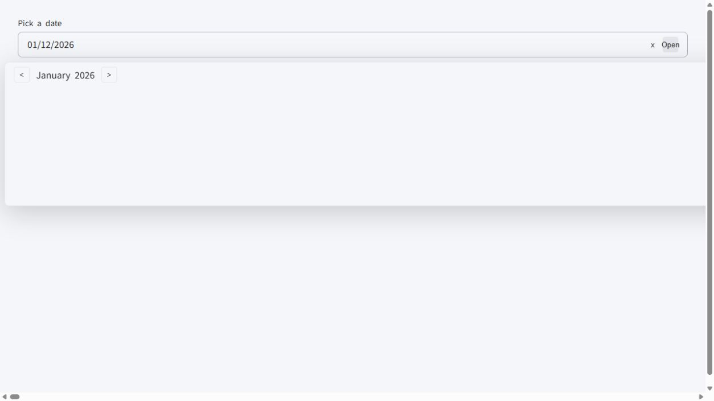
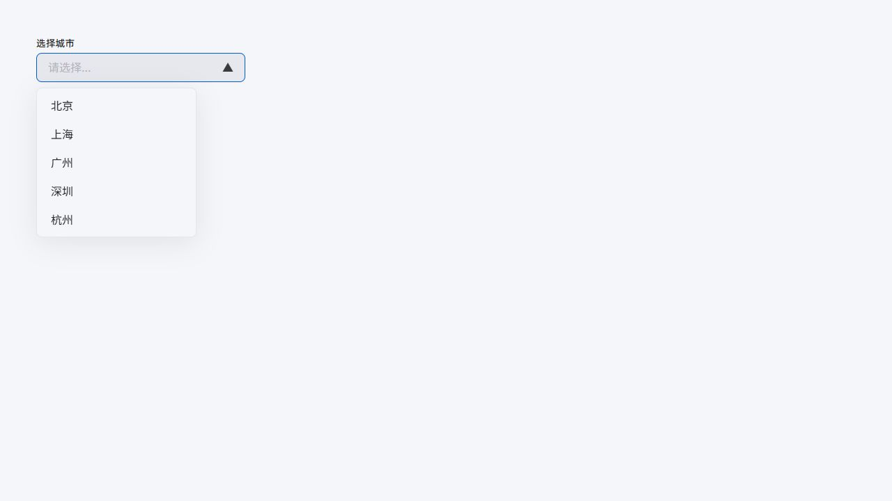
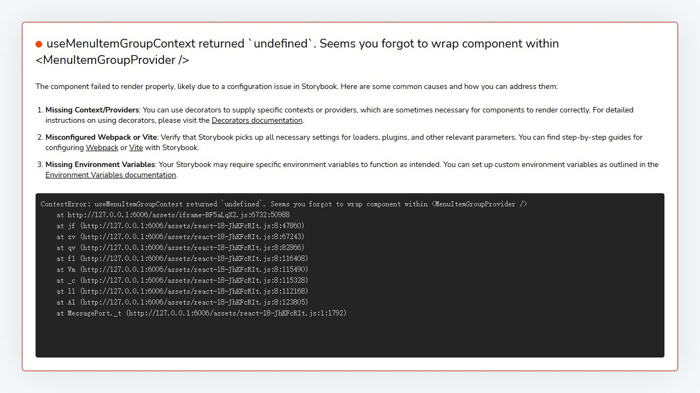
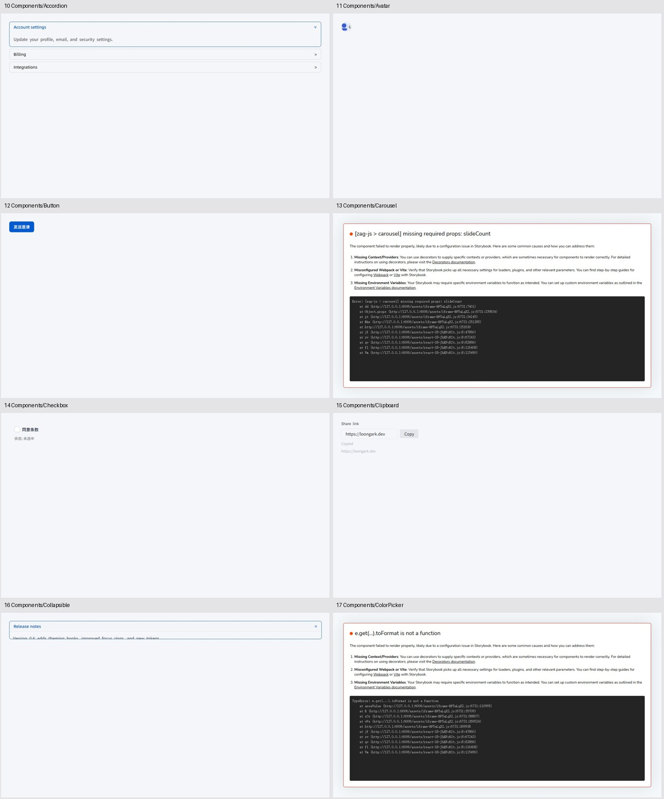
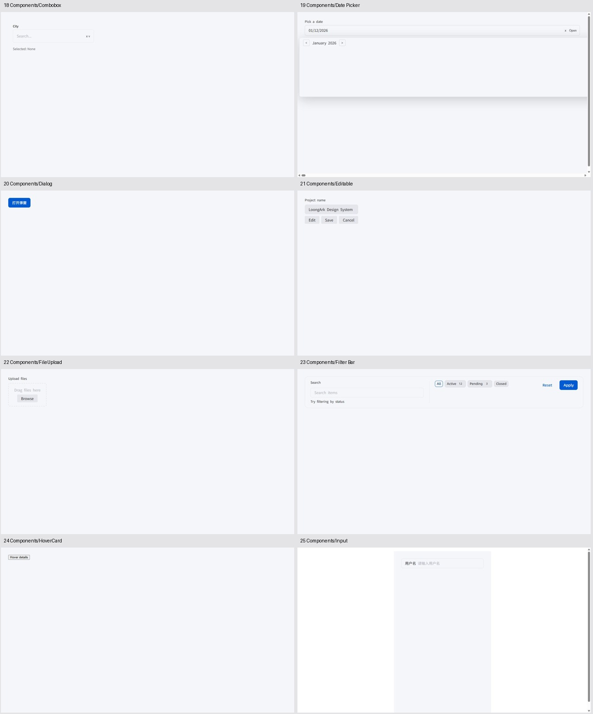
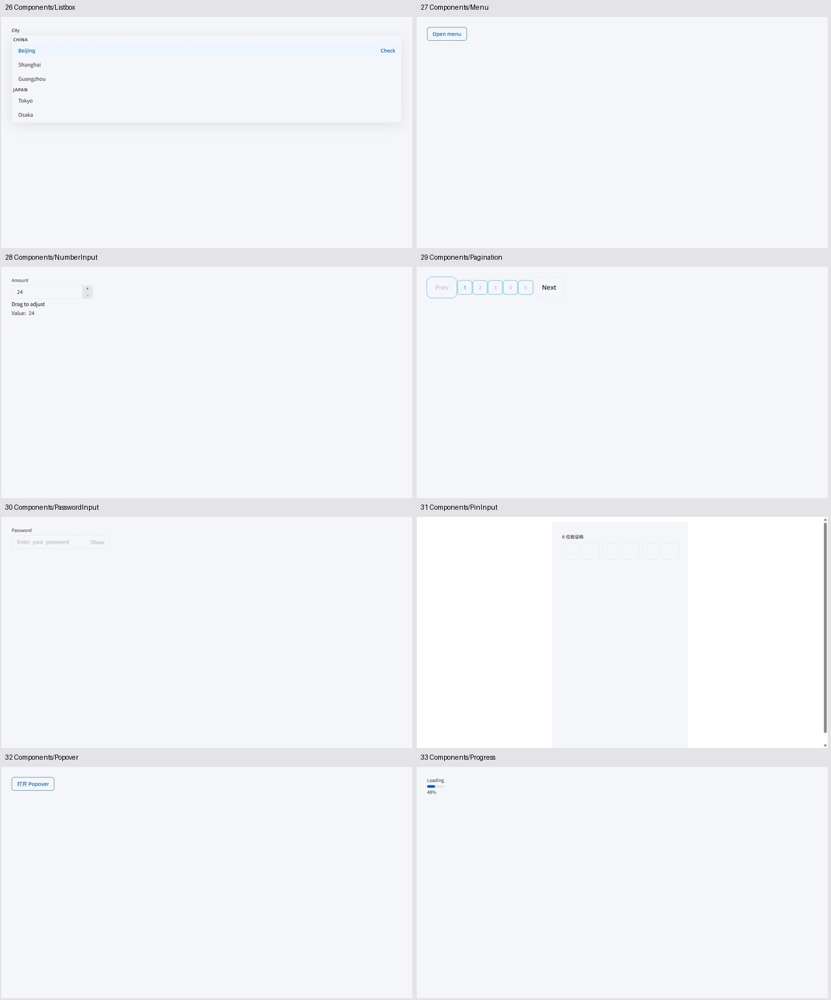
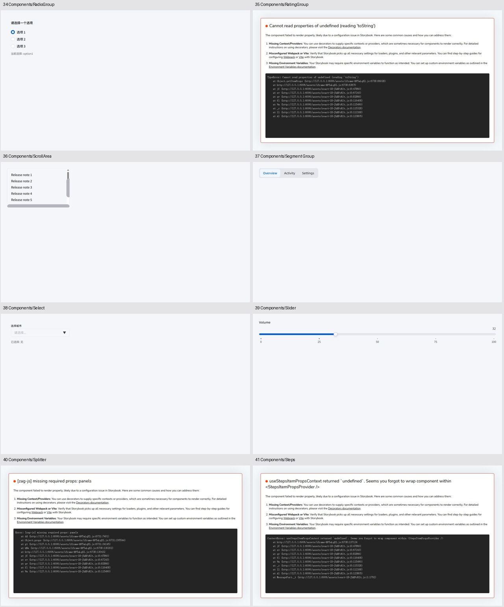
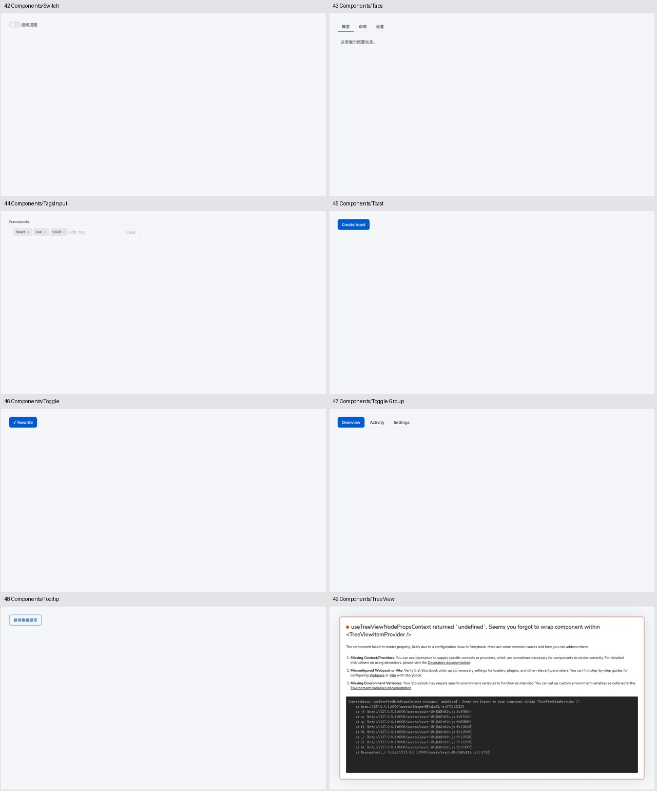

# LoongArk 全面审查

审查日期：2026 年 10 月 2 日。目标是组件效果、Token、架构、四框架一致性及组件缺口；视觉方向参考 shadcn 官方默认主题与示例。

**结论：分层方向合理，组件源码覆盖较广，但尚未达到可稳定发布、四端一致、视觉接近 shadcn 默认风格的状态。应先修运行和发布，再统一主题与视觉，最后扩充组件。**

本次实际检查当前工作区，包含已有未提交修改。新增审查报告和证据，未实施组件修复。构建更新了生成物，不应把工作区所有变更归因于本次审查。

## 审查范围和结果

| 维度 | 结果 | 关键依据 |
| --- | --- | --- |
| 组件效果和样式 | 需要集中整改 | 164 个 React Storybook 示例中 31 个首屏渲染报错；日期浮层严重横向溢出；表单排版和暗色对比度失效 |
| Token 规范和美观 | 尚未形成完整系统 | 748 处契约引用中 29 处指向未定义 Token，共 18 个不同路径；缺少按用途区分的明暗语义色 |
| 架构和整洁度 | 分层合理，生命周期和验证薄弱 | 主题作用域不隔离、样式挂载重复、源码与生成物混杂、shim 掩盖真实依赖契约 |
| 四框架支持 | 不能认定完善或效果一致 | Solid、Vue 真实入口导入失败；Svelte 缺失 359 个源声明文件；浏览器故事仅覆盖 React |
| 组件覆盖 | 已有 40 个组件家族，完成度被高估 | 39 个 primitive 加 Filter Bar；现有覆盖表剩 9 项，shadcn 常规范围另缺 25 项 |

已完成 `pnpm run verify` 和 `pnpm storybook:build`，均通过。浏览器逐个访问全部 164 个故事，捕获 40 类组件基线以及 9 个重点状态；另检查输入、弹窗打开、Escape 关闭和回焦、Select 选择、390px 窄屏布局。通过构建不代表运行或无障碍合格。

仓库已有 2 条普通 e2e、2 条视觉测试，视觉测试中含一次 Axe 检查，主要覆盖两个 React 组合示例。本次没有执行这些 Playwright 测试，也没有全量键盘、读屏、跨浏览器或四端视觉回归。已有截图基准不是本次通过证据。

## 必须优先解决的问题

优先级解释：P1 为阻碍运行、发布或关键使用的缺陷；P2 为一致性、维护和视觉整改。下列运行错误首先证明示例不合格，不应据此断言整个 Ark 组件能力不可用。

### P1 首屏报错 31 个示例

| 组件 | 报错示例数 | 实际错误或不匹配 | 源码位置 |
| --- | ---: | --- | --- |
| Carousel | 5 | 缺少必需的 `slideCount` | `stories/LoongArkCarousel.stories.tsx:47` |
| Color Picker | 5 | `toFormat is not a function`；受控值为字符串，实际颜色接口未对齐 | `stories/LoongArkColorPicker.stories.tsx:54` |
| Rating Group | 5 | undefined 的 `toString`；Item 使用 `value`，需要核对实际 Item 的 index 契约 | `stories/LoongArkRatingGroup.stories.tsx:50` |
| Splitter | 5 | 缺少必需的 `panels` | `stories/LoongArkSplitter.stories.tsx:39` |
| Steps | 5 | 缺少 Steps Item 上下文；Separator 在 Item 外 | `stories/LoongArkSteps.stories.tsx:64` |
| Tree View | 5 | 缺少 TreeView Item 上下文；collection 和 node 接口未对齐 | `stories/LoongArkTreeView.stories.tsx:49` |
| Menu | 1 | Options 的 ItemGroupLabel 没有 ItemGroupProvider | `stories/LoongArkMenu.stories.tsx:94` |

完整错误列表见 [source-checks.json](./source-checks.json)。Menu Basic 可渲染，与 Options 报错并不矛盾。

### P1 日期选择器布局失效

Basic 和 Range 两个示例在 1280px 视口下产生约 **1,000,042px** 的页面横向宽度。DOM 中日历 table 宽约 1,000,000px，浮层几乎是大片空白，日期单元格远离可见区域。`table { width:100%; table-layout:fixed }` 与浮层内在尺寸计算相互撑大是优先排查方向，需修复后验证，不能仅通过裁剪隐藏溢出。

源码：`packages/primitives/src/date-picker.ts:329`、`:504`；截图步骤 05、19。

### P1 暗色主题没有成立

`ThemeRuntime` 不论 mode 都从同一套 baseTokens 开始；dark 的变化主要是 CSS 选择器和 style ID。`mount()` 没有设置匹配 `html[data-theme='dark']` 的属性。Storybook 给外层深色背景，但文字、表单和浮层仍保留浅色规则；组合示例内部还写死 `LoongArkProvider mode="light"`。

因此步骤 03 中标签、说明文字落在近黑背景上几乎不可读，步骤 04 弹窗仍是浅色。high-contrast 也没有专门 Token，其无障碍能力未获验证。

源码：`packages/theme/src/index.ts:69`、`:78`、`:112`；`examples/react/ButtonInputDialog.tsx:26`。

### P1 输入和弹窗语义需要修复

- 组合表单存在 **button 嵌套 button**：InputSuffix 的 clear action 外层按钮内又放 LoongArkButton。标签位于 Field.Root 外，未与输入建立关联。源码：`examples/react/ButtonInputDialog.tsx:29`、`:39`。
- invalid 示例把 Label、Control、ErrorText 横向挤在同一个输入容器内，字段宽度被压缩；Root 的视觉 `state="invalid"` 没有同步为 Ark Field 的 `invalid`，实际 input 未获得 `aria-invalid`。ErrorText 只是 HelperText 的颜色变体。源码：`packages/react/src/components/input.tsx:31`、`:170`；步骤 08。
- 关闭弹窗后，内容仍留在可访问树中；观测到 closed 内容 opacity 为 0，内部按钮仍有 tabIndex 0。已验证 Escape 回到触发按钮；尚未逐个验证隐藏按钮是否仍能通过 Tab 到达。关闭动画之后应由 presence/unmount 或可靠的隐藏语义移除内容。源码：`packages/primitives/src/dialog.ts:284`。
- Pagination 页码的可访问名称为 `page undefined`，故事自行维护视觉 page，没有把 page/count/pageSize 和 Item value/type 接到 Ark。源码：`stories/LoongArkPagination.stories.tsx:37`、`:50`；步骤 29。

## 对标 shadcn 的视觉和 Token 改造

shadcn 的官方主题采用按用途配对的背景与前景变量，并定义明暗模式；Button 的官方接口提供六类视觉变体及独立图标尺寸。这支持下面的方向建议。具体尺寸和圆角仍应锁定一个 shadcn 版本、样式和示例后确定，不应混用不同版本。[官方主题文档](https://ui.shadcn.com/docs/theming)，[官方 Button 文档](https://ui.shadcn.com/docs/components/button)。

本次无法在浏览器中取得 shadcn 参考截图，远程页面导航超时。因此以下是依据官方主题与接口，加上本项目真实截图作出的设计判断，**没有进行像素级对照**。

| 项目现状 | 视觉影响 | 建议 |
| --- | --- | --- |
| 默认主色为亮蓝 `#005BD3`，大部分背景 `#F5F6FA` | 更像品牌主题；层次和 shadcn 中性默认风格有距离 | 默认主题使用中性 primary；现有蓝色保留为品牌预设 |
| 直接用 neutral 数字与 brand 色表现状态 | 无法系统处理暗色、错误、成功与强调 | 建立 background/foreground、surface、muted、border、input、ring、destructive、success 等语义角色 |
| placeholder 与 surface 对比约 1.91:1 | 占位文字很淡 | 正常尺寸文字以 4.5:1 为验收目标；为禁用态另定规则 |
| border 与 surface 对比约 1.15:1，输入背景接近页面 | 控件边界不清晰 | 用背景、边框、焦点环共同区分控件；按实际控件辨识需要检查非文本对比 |
| Button/Input 独立推导高度与间距 | 同行控件难以保持统一密度 | 统一 control-height、padding、line-height；定义紧凑的常规尺寸体系 |
| lg Button 用 radius.lg 16px，lg Input 用 radius.md 8px | 同尺寸外观不统一 | 圆角按控件角色统一，不随字体大小机械扩大 |
| 输入和浮层有较大阴影，弹窗有重模糊 | 页面更厚重，偏离干净默认示例 | 减少常驻输入阴影；浮层使用一套轻量 elevation |
| Button 只有 solid/outline/ghost | 缺少通用操作层级 | 补 secondary/destructive/link 和明确的 icon 尺寸；保持名称映射兼容 |
| Emoji、文本箭头等混用 | 图标笔画、基线和大小不稳定 | 统一 SVG 图标体系、尺寸、stroke 和图标按钮名称 |

Token 静态检查共发现 **18 个路径未定义、29 处引用**：`shadow.xl/sm`、`space.component.xl/xxl`、`color.brand.primaryHover/subtle`、`color.neutral.200/400/600/border/borderStrong/bg/text`、`color.white`、`color.border.default/hover`、`color.bg.default`、`color.text.primary`。详情和可重复执行的检查见 [inspect-source.mjs](./inspect-source.mjs) 与 [source-checks.json](./source-checks.json)。

应让契约 Token 路径具有类型约束，并在构建时检查引用存在。当前 fallback 会使缺失被静默掩盖。Input、Select 的阴影直接写在组件内；Dialog 的 z-index 硬编码为 1000/1001，低于 Token 中 toast 1300、tooltip 1200，也未使用 dialog 1400，浮层叠放存在风险。

建议的 Token 分层为 **基础值 → 明暗语义角色 → 组件尺寸与状态**。优先保留共享基础和语义层，组件 Token 只覆盖确实不同的行为。字体需要明确加载或可靠系统回退；当前自定义字体名称本身不能保证用户设备实际拥有字体。

## 架构和四框架支持

`tokens → theme → primitives → kit → adapters` 的依赖方向值得保留，没有发现明显循环。Primitive 共享样式、Kit 提供组合、各框架提供适配，这个划分适合当前目标。需要深化的是生命周期、真实类型和发布验证。

| 框架 | 本次证据 | 结论 |
| --- | --- | --- |
| React | 全部 164 个故事真实浏览器访问；31 个首屏错误 | 支持最容易检查，但目前仍有明显缺陷 |
| Vue | 构建通过；真实 dist 主入口导入失败 | `tooltip.ts:3` 引用 `@ark-ui/vue/portal`，当前安装版本无对应文件；不能认定发布可用 |
| Solid | 构建通过；真实 dist 主入口导入失败 | `react-jsx` 输出引用 `solid-js/jsx-runtime` 的 jsx，真实 Solid 无此导出；需要 Solid 编译链 |
| Svelte | 327 个组件声明加 32 个聚合声明未进入 dist；只有 4 个由 TS 生成的辅助声明 | 发布类型支持不完整；同屏渲染、事件、双向绑定尚未验证 |

Solid/Vue 的复现使用 `node --conditions=browser --input-type=module` 导入各自 `packages/*/dist/index.js`，错误分别为 `jsx` 导出不存在和 Vue Portal 模块不存在。它们是现有发布产物的实际故障，不是四端视觉不同的推测。可重复执行 [check-publication.mjs](./check-publication.mjs)，实际输出见 [publication-checks.json](./publication-checks.json)。

Svelte 还声明 peer `svelte >=4.0.0`，实际安装的 Ark Svelte 5.15.0 要求 `svelte >=5.20.0`。应收窄兼容声明或提供经过验证的兼容实现。React Dialog namespace 有 Portal/Positioner，Svelte namespace 没有这两项；不能仅凭顶层导出同名断言复合 API 一致。

架构整改建议：

1. **统一样式生命周期。** theme、primitives、kit 各自处理 style/document；同 mode Provider 共享 style ID，全局 data-scope 选择器和插值颜色会互相覆盖。收敛挂载、更新、卸载、主题作用域和 host；Provider 负责生命周期，primitive 只贡献规则。
2. **兑现或收窄 ShadowRoot 能力。** 公开 mount 接收 ShadowRoot，但变量选择器仍是 :root/html；bootstrap 不把 host 传到组件样式，很多样式仍落全局 document。需要端到端验证 :host 和同一挂载目标。
3. **建立真实发布消费检查。** 当前 tsconfig 将框架和 Ark 指向本地 shim；docs 明确这是骨架设计意图，可保留快速检查，但应增加真实依赖的类型、打包和消费验证。`verify-workspace` 主要检查 manifest 字符串，没有核验出口文件与可导入性。
4. **共享组件契约并校验适配器。** 当前 defaults 在 primitive 和四端重复，`examples/api-consistency.ts` 只比顶层导出名。增加复合 parts、Props、默认值、受控/非受控事件以及相同情景的截图验证。
5. **分离源码和生成物。** tokens/src 同时有 TS、旧 JS、旧声明；仓库追踪 tsbuildinfo、storybook-static。让 dist 承担产物，源码保留单一事实；统一 pinInput/filterBar/styleSheet 等命名约定。取消追踪应在实现阶段单独审查，不能直接删除所有工作区文件。
6. **更新文档契约。** coverage 的“全部完成”与实测矛盾；`brand:"shaloong"` 实际被当颜色输出；文档中的 CSS/JSON 子路径需与 package exports 核对。

默认 motionPreference 为 force，还会修改 documentElement；组件 reduced-motion 规则因此默认被绕过。建议默认 auto，并检查动画结束后状态。全部组件自动 bootstrap 是现有设计，不能仅凭目录结构判断冗余；应先测量启动和样式体积，再决定按需路径。

## 还有多少组件应做未做

必须区分“已有入口”“可靠完成”和“目标范围”。现有 registry **39 个 primitive + Filter Bar = 40 个家族**。Progress Linear/Circular 是一个家族；原表用两行统计，所以显示 41/50 和 82%，这不是质量合格率。

### 现有项目计划剩 9 项

Field、Fieldset、Angle Slider、Floating Panel、Marquee、QR Code、Signature Pad、Timer、Tour。其中 Field 有 Input 的局部替代，但没有通用 Field API；其余特殊组件是否需要应由业务决定。按家族去重是 40/49，约 81.6% 的源码入口覆盖率。

### 按 shadcn 常规网站组件范围缺 25 项

本次官方目录共 64 项，其中 6 项为较新的消息、附件等扩展。其余 58 项映射为 **28 项已有相应入口、5 项部分覆盖、25 项尚无对应公开组件**。已有入口中仍包含本次报错的 Carousel、Resizable 等，不代表已可用。[官方组件目录](https://ui.shadcn.com/docs/components)。

| 优先级建议 | 缺少的组件 | 数量 |
| --- | --- | ---: |
| 第一批，构成常见应用页面 | Card、Badge、Separator、Skeleton、Alert、Alert Dialog、Table、Sheet、Breadcrumb | 9 |
| 第二批，复杂页面与导航 | Data Table、Command、Navigation Menu、Sidebar、Drawer、Menubar、Empty、Spinner | 8 |
| 第三批，补布局和文档原语 | Aspect Ratio、Button Group、Chart、Direction、Item、Kbd、Native Select、Typography | 8 |

部分覆盖的 5 项为 Calendar（DatePicker inline）、Context Menu（MenuContextTrigger）、Field（Input Field）、Input Group（prefix/suffix）、Label（字段内 Label）。要补独立文档、标准组合和完整状态，不应全部算作全新组件。Textarea、Input OTP、Dropdown Menu、Resizable 分别已有 TextareaControl、PinInput、Menu、Splitter，避免重复建设。

另有 Attachment、Bubble、Marker、Message、Message Scroller、Questionnaire 六项扩展；目前不建议无业务需求就纳入必做。25 项 shadcn 缺口与原计划 9 项有不同口径，**不能直接相加**。建议先稳定现有 40 类，再补通用页面原语；Angle Slider 等专用控件可以后置。

## 实施顺序和验收

| 阶段 | 工作 | 验收条件 |
| --- | --- | --- |
| 1 稳定运行和发布 | 修复 31 个故事错误、DatePicker、Vue/Solid 入口、Svelte 声明 | 所有故事首屏无错误；真实四端消费者可安装、构建和导入；无页面横向异常 |
| 2 主题和核心控件 | 完整语义 Token、明暗切换、作用域、Field 排版及语义、弹窗隐藏 | light/dark 下核心控件可读；控件状态关联正确；主题切换不污染相邻实例 |
| 3 统一视觉 | 先打磨 Button/Input/Select/Dialog/Menu/Tabs/Checkbox，再扩展全库 | 同行高度、圆角、图标、边框、浮层统一；锁定 shadcn 参考版本并进行同屏截图对照 |
| 4 四端一致性 | 每端创建相同表单、筛选栏和弹窗场景 | 默认值、事件、键盘路径与截图一致；覆盖受控和非受控用法 |
| 5 扩展组件 | 第一批九项，再按业务推进 | 每项具备四端消费、文档、状态与回归证据，再计入完成 |

不建议推倒当前分层，也不建议直接继续堆 P4 组件。最大的收益来自把“源码覆盖”转变为“真实消费和视觉验收通过”。

## 截图步骤和证据

以下图片均来自本次真实浏览器审查。基线首屏正常仅代表该截图无运行错误；不代表功能或无障碍全部通过。错误页记录的是阻碍审查的实际状态。

| 步骤 | 状态 | 健康度和说明 | 截图 |
| --- | --- | --- | --- |
| 01 | 浅色邀请表单 | 可显示；嵌套按钮、标签关联和控件对比需要修复 | [截图](./01-form-light.jpg) |
| 02 | 浅色弹窗打开 | 打开和 Escape 回焦可用；布局及关闭隐藏语义需修复 | [截图](./02-dialog-light.jpg) |
| 03 | 暗色邀请表单 | 不合格；标签、说明几乎不可读 | [截图](./03-form-dark.jpg) |
| 04 | 暗色弹窗打开 | 不合格；弹窗仍使用浅色面板 | [截图](./04-dialog-dark.jpg) |
| 05 | 日期浮层打开 | 不合格；巨大横向溢出，日历不可用 | [截图](./05-date-picker-open.jpg) |
| 06 | Select 打开和选择 | 主要路径可用；视觉仍需统一 | [截图](./06-select-open.jpg) |
| 07 | 390px Filter Bar | 本次窄屏换行正常，无横向溢出 | [截图](./07-filter-mobile.jpg) |
| 08 | Input invalid | 不合格；横向拥挤、缺少无效语义 | [截图](./08-input-invalid.jpg) |
| 09 | Menu Options | 阻塞；上下文错误，无法渲染 | [截图](./09-menu-options-error.jpg) |

### 组件基线

每类组件的步骤、首屏健康度和原图链接见下表；后面的五张总览按相同顺序排列。完整 DOM、页面尺寸与故事元数据保存在 [component-captures.json](./component-captures.json)，其余 124 个示例记录保存在 [story-sweep.json](./story-sweep.json)。

| 步骤 | 组件和状态 | 健康度 | 截图 |
| --- | --- | --- | --- |
| 10 | Accordion / Basic | 首屏可渲染，交互完整性待验收 | [原图](./10-components-accordion--basic.jpg) |
| 11 | Avatar / Playground | 首屏可渲染，交互完整性待验收 | [原图](./11-components-avatar--playground.jpg) |
| 12 | Button / Playground | 首屏可渲染，交互完整性待验收 | [原图](./12-components-button--playground.jpg) |
| 13 | Carousel / Basic | 阻塞，首屏运行错误 | [原图](./13-components-carousel--basic.jpg) |
| 14 | Checkbox / Playground | 首屏可渲染，交互完整性待验收 | [原图](./14-components-checkbox--playground.jpg) |
| 15 | Clipboard / Basic | 首屏可渲染，交互完整性待验收 | [原图](./15-components-clipboard--basic.jpg) |
| 16 | Collapsible / Basic | 首屏可渲染，交互完整性待验收 | [原图](./16-components-collapsible--basic.jpg) |
| 17 | ColorPicker / Basic | 阻塞，首屏运行错误 | [原图](./17-components-colorpicker--basic.jpg) |
| 18 | Combobox / Playground | 首屏可渲染，交互完整性待验收 | [原图](./18-components-combobox--playground.jpg) |
| 19 | Date Picker / Basic | 不合格，日期浮层巨大横向溢出 | [原图](./19-components-date-picker--basic.jpg) |
| 20 | Dialog / Playground | 首屏可渲染，交互完整性待验收 | [原图](./20-components-dialog--playground.jpg) |
| 21 | Editable / Basic | 首屏可渲染，交互完整性待验收 | [原图](./21-components-editable--basic.jpg) |
| 22 | FileUpload / Basic | 首屏可渲染，交互完整性待验收 | [原图](./22-components-fileupload--basic.jpg) |
| 23 | Filter Bar / Basic | 首屏可渲染，交互完整性待验收 | [原图](./23-components-filter-bar--basic.jpg) |
| 24 | HoverCard / Basic | 首屏可渲染，交互完整性待验收 | [原图](./24-components-hovercard--basic.jpg) |
| 25 | Input / Playground | 需修复，状态和字段布局见步骤 08 | [原图](./25-components-input--playground.jpg) |
| 26 | Listbox / Basic | 首屏可渲染，交互完整性待验收 | [原图](./26-components-listbox--basic.jpg) |
| 27 | Menu / Basic | Basic 可渲染，Options 在步骤 09 报错 | [原图](./27-components-menu--basic.jpg) |
| 28 | NumberInput / Basic | 首屏可渲染，交互完整性待验收 | [原图](./28-components-numberinput--basic.jpg) |
| 29 | Pagination / Basic | 需修复，页码名称为 page undefined | [原图](./29-components-pagination--basic.jpg) |
| 30 | PasswordInput / Basic | 首屏可渲染，交互完整性待验收 | [原图](./30-components-passwordinput--basic.jpg) |
| 31 | PinInput / Basic | 首屏可渲染，交互完整性待验收 | [原图](./31-components-pininput--basic.jpg) |
| 32 | Popover / Basic | 首屏可渲染，交互完整性待验收 | [原图](./32-components-popover--basic.jpg) |
| 33 | Progress / Basic | 首屏可渲染，交互完整性待验收 | [原图](./33-components-progress--basic.jpg) |
| 34 | RadioGroup / Playground | 首屏可渲染，交互完整性待验收 | [原图](./34-components-radiogroup--playground.jpg) |
| 35 | RatingGroup / Basic | 阻塞，首屏运行错误 | [原图](./35-components-ratinggroup--basic.jpg) |
| 36 | ScrollArea / Basic | 首屏可渲染，交互完整性待验收 | [原图](./36-components-scrollarea--basic.jpg) |
| 37 | Segment Group / Basic | 首屏可渲染，交互完整性待验收 | [原图](./37-components-segment-group--basic.jpg) |
| 38 | Select / Playground | 首屏可渲染，交互完整性待验收 | [原图](./38-components-select--playground.jpg) |
| 39 | Slider / Basic | 首屏可渲染，交互完整性待验收 | [原图](./39-components-slider--basic.jpg) |
| 40 | Splitter / Basic | 阻塞，首屏运行错误 | [原图](./40-components-splitter--basic.jpg) |
| 41 | Steps / Basic | 阻塞，首屏运行错误 | [原图](./41-components-steps--basic.jpg) |
| 42 | Switch / Playground | 首屏可渲染，交互完整性待验收 | [原图](./42-components-switch--playground.jpg) |
| 43 | Tabs / Basic | 首屏可渲染，交互完整性待验收 | [原图](./43-components-tabs--basic.jpg) |
| 44 | TagsInput / Basic | 首屏可渲染，交互完整性待验收 | [原图](./44-components-tagsinput--basic.jpg) |
| 45 | Toast / Basic | 首屏仅触发器，通知完整交互待验证 | [原图](./45-components-toast--basic.jpg) |
| 46 | Toggle / Basic | 首屏可渲染，交互完整性待验收 | [原图](./46-components-toggle--basic.jpg) |
| 47 | Toggle Group / Basic | 首屏可渲染，交互完整性待验收 | [原图](./47-components-toggle-group--basic.jpg) |
| 48 | Tooltip / Basic | 首屏可渲染，交互完整性待验收 | [原图](./48-components-tooltip--basic.jpg) |
| 49 | TreeView / Basic | 阻塞，首屏运行错误 | [原图](./49-components-treeview--basic.jpg) |

## shadcn 目录逐项映射

入口存在不等于实现合格；本表只用于范围统计。

| 官方目录项 | 对应能力 | 范围状态 |
| --- | --- | --- |
| Accordion | Accordion | 已有对应入口 |
| Alert | — | 缺少 |
| Alert Dialog | — | 缺少 |
| Aspect Ratio | — | 缺少 |
| Attachment | — | 扩展，按业务评估 |
| Avatar | Avatar | 已有对应入口 |
| Badge | — | 缺少 |
| Breadcrumb | — | 缺少 |
| Bubble | — | 扩展，按业务评估 |
| Button | Button | 已有对应入口 |
| Button Group | — | 缺少 |
| Calendar | DatePicker inline | 部分覆盖 |
| Card | — | 缺少 |
| Carousel | Carousel | 已有对应入口 |
| Chart | — | 缺少 |
| Checkbox | Checkbox | 已有对应入口 |
| Collapsible | Collapsible | 已有对应入口 |
| Combobox | Combobox | 已有对应入口 |
| Command | — | 缺少 |
| Context Menu | MenuContextTrigger | 部分覆盖 |
| Data Table | — | 缺少 |
| Date Picker | Date Picker | 已有对应入口 |
| Dialog | Dialog | 已有对应入口 |
| Direction | — | 缺少 |
| Drawer | — | 缺少 |
| Dropdown Menu | Menu | 已有对应入口 |
| Empty | — | 缺少 |
| Field | Input 的 Field 封装 | 部分覆盖 |
| Hover Card | Hover Card | 已有对应入口 |
| Input | Input | 已有对应入口 |
| Input Group | Input prefix/suffix | 部分覆盖 |
| Input OTP | PinInput | 已有对应入口 |
| Item | — | 缺少 |
| Kbd | — | 缺少 |
| Label | InputLabel 等字段 Label | 部分覆盖 |
| Marker | — | 扩展，按业务评估 |
| Menubar | — | 缺少 |
| Message | — | 扩展，按业务评估 |
| Message Scroller | — | 扩展，按业务评估 |
| Native Select | — | 缺少 |
| Navigation Menu | — | 缺少 |
| Pagination | Pagination | 已有对应入口 |
| Popover | Popover | 已有对应入口 |
| Progress | Progress | 已有对应入口 |
| Questionnaire | — | 扩展，按业务评估 |
| Radio Group | Radio Group | 已有对应入口 |
| Resizable | Splitter | 已有对应入口 |
| Scroll Area | Scroll Area | 已有对应入口 |
| Select | Select | 已有对应入口 |
| Separator | — | 缺少 |
| Sheet | — | 缺少 |
| Sidebar | — | 缺少 |
| Skeleton | — | 缺少 |
| Slider | Slider | 已有对应入口 |
| Spinner | — | 缺少 |
| Switch | Switch | 已有对应入口 |
| Table | — | 缺少 |
| Tabs | Tabs | 已有对应入口 |
| Textarea | TextareaControl | 已有对应入口 |
| Toast | Toast | 已有对应入口 |
| Toggle | Toggle | 已有对应入口 |
| Toggle Group | Toggle Group | 已有对应入口 |
| Tooltip | Tooltip | 已有对应入口 |
| Typography | — | 缺少 |
